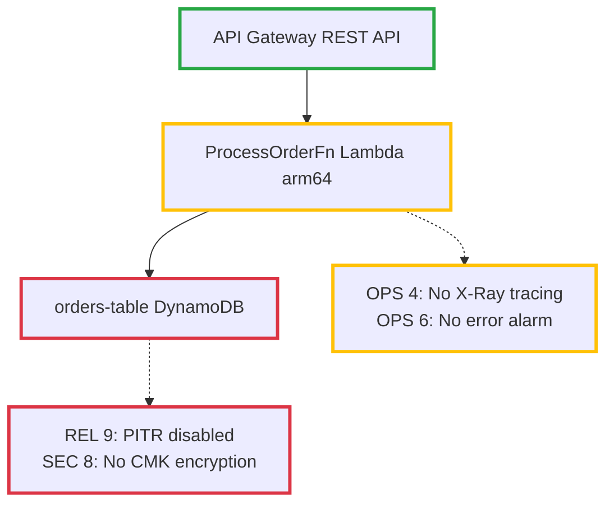
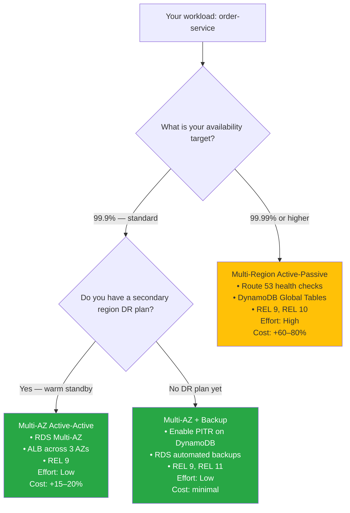
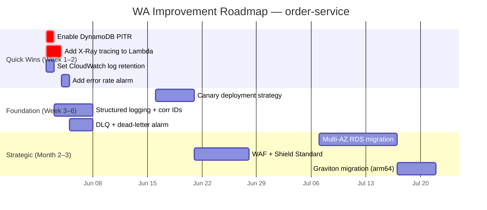

The `wa-builder` skill is the educational and generative counterpart to the assessment skills. Where `wa-review` evaluates and scores, `wa-builder` teaches and creates. It adapts WA framework guidance to your specific workload, then produces visual artifacts you can commit directly to your repository — color-annotated architecture diagrams, architectural decision trees, and improvement roadmaps with dependency ordering.

## What it does

<CardGroup cols={2}>
  <Card title="Personalized WA Learning" icon="graduation-cap">
    Explains Well-Architected concepts using your actual services and patterns as examples. Beginner explanations include analogies; practitioner mode skips the teaching and goes straight to artifact generation.
  </Card>
  <Card title="Architecture Diagrams" icon="diagram-project">
    Produces PlantUML diagrams (primary) and Mermaid alternatives with color-coded pillar health overlays — green for healthy areas, yellow for partial gaps, red for critical risks — with BP IDs cited on every annotation.
  </Card>
  <Card title="Decision Trees" icon="code-branch">
    Generates Mermaid flowcharts for the most impactful architectural choices your workload faces: serverless vs containers, single vs multi-region, canary vs blue/green, SQL vs NoSQL. Each branch ends with a concrete recommendation citing WA BP IDs.
  </Card>
  <Card title="Improvement Roadmaps" icon="map">
    Creates Gantt charts showing Quick Wins, Foundation, and Strategic phases with dependency ordering — so you know not just what to improve, but in what sequence.
  </Card>
</CardGroup>

## wa-builder vs wa-review

<Tip>
  Use `wa-builder` when you want to **understand or communicate** Well-Architected for your workload, or need **visual artifacts** for documentation, design reviews, or stakeholder presentations.

  Use `wa-review` when you want a **scored assessment** with evidence-backed findings, gap analysis, and a remediation plan.
</Tip>

| | `wa-builder` | `wa-review` |
|--|-------------|------------|
| **Primary output** | Diagrams, decision trees, roadmaps | Findings report with gaps and evidence |
| **Tone** | Educational and generative | Evaluative and evidence-backed |
| **WA experience needed** | None — the skill teaches as it goes | Helpful but not required |
| **Scores your workload** | No | Yes, per WA question |
| **Can consume wa-review output** | Yes — richer artifacts from review data | — |
| **Best for** | Learning, diagramming, design sessions | Formal reviews, audits, remediation planning |

## Adaptive experience levels

The skill detects your WA familiarity from language and adapts accordingly:

<Tabs>
  <Tab title="Beginner">
    Full pillar explanations with analogies before any artifacts are produced. Decision tree nodes include "what does this mean?" context. Every annotation is explained in the diagram legend.

    **Detection signals**: asks "what is WA?", "how does this apply to me?", unfamiliar with terms like HRI, RTO/RPO, blast radius.
  </Tab>
  <Tab title="Familiar">
    Concise pillar relevance summaries focused on gaps. Standard decision flows. Brief legend on diagrams. Learning phase is condensed to key gaps only.

    **Detection signals**: knows the pillar names, asks about specific trade-offs, understands general cloud architecture patterns.
  </Tab>
  <Tab title="Practitioner">
    Skips the learning phase entirely. Produces raw artifacts immediately. Decision trees are compact trade-off matrices rather than full flowcharts.

    **Detection signals**: uses "pillar", "HRI", "RTO/RPO", "blast radius" naturally in the request.
  </Tab>
</Tabs>

## How to invoke it

<CodeGroup>
```text Explain WA
Explain how the Well-Architected Framework applies to my Lambda architecture
```

```text Create a diagram
Create a WA-annotated architecture diagram for this service
```

```text Decision tree
Show me a decision tree for choosing between multi-AZ and multi-region
```

```text Roadmap
Build a WA improvement roadmap I can share with my team
```

```text Post-review artifacts
I have a wa-review report — generate a visual roadmap and architecture diagram from it
```
</CodeGroup>

## Artifact 1: Architecture diagram with WA annotations

The agent produces a PlantUML diagram with color-coded pillar health overlays and a Mermaid alternative. Both include BP ID citations on every annotation.

<CodeGroup>
```plantuml PlantUML (primary)
@startuml
!define GOOD #28a745
!define WARN #ffc107
!define RISK #dc3545

skinparam component {
  BackgroundColor White
  BorderColor Black
}

' Color indicates pillar health across all 6 pillars
rectangle "API Gateway\n[REST API]" as apigw GOOD
rectangle "ProcessOrderFn\n[Lambda arm64]" as fn WARN
rectangle "orders-table\n[DynamoDB]" as ddb RISK

apigw --> fn : invoke
fn --> ddb : read/write

note right of fn #WARN
  **Partial gaps**
  OPS 4: No X-Ray tracing enabled
  OPS 6: No provisioned concurrency
  alarm for errors missing
end note

note right of ddb #RISK
  **Critical gaps**
  REL 9: PITR not enabled
  REL 9: No DLQ on stream consumer
  SEC 8: CMK encryption absent
end note

legend right
  | Color | Pillar Health |
  | <GOOD> | Key BPs implemented |
  | <WARN> | Partial gaps exist |
  | <RISK> | Critical/High gaps |
endlegend
@enduml
```


</CodeGroup>

## Artifact 2: Decision trees

The agent generates 2–3 Mermaid decision trees for the most impactful architectural choices your workload faces, with each leaf node citing the WA Best Practice ID that underpins the recommendation.



## Artifact 3: Improvement roadmap

The agent produces a Mermaid Gantt chart plus an ASCII dependency graph showing what must be completed before each item can begin.

<CodeGroup>


```text ASCII dependency graph
IMPROVEMENT DEPENDENCY GRAPH
============================

[Enable PITR] ─────────────────────────────────┐
[Add X-Ray tracing] ──► [Add error alarm] ──────┤
[Set log retention] ──► [Structured logging] ───┤
                                                 ▼
                    [Canary deploy strategy] ──► [WAF + Shield]
                              │
[DLQ + dead-letter alarm] ───┘
              │
              ▼
     [Multi-AZ RDS] ──► [Graviton migration]

Legend:
  ──► = "must complete before"
  [ ] = improvement item
```
</CodeGroup>

## Working with prior wa-review output

If you have already run `wa-review`, share the report when invoking `wa-builder`. The agent parses it to extract:

- Pillar scores from the scorecard (used for diagram color-coding)
- Findings by severity (used for decision tree branching priorities)
- Evidence locations (file:line) (used for roadmap item descriptions)
- Existing remediation plan items (used for Gantt chart phases and dependency ordering)

<Note>
  Providing `wa-review` output produces significantly richer artifacts because the color-coding reflects scored gaps rather than inferred health signals, and the roadmap reflects actual finding severity rather than heuristic prioritization.
</Note>

## Commit guidance

After generating artifacts, the agent suggests standard commit locations:

```bash
docs/architecture/wa-annotated.puml        # Architecture diagram (PlantUML)
docs/architecture/wa-annotated.md          # Mermaid alternative + legend
docs/decisions/compute-strategy.md        # Decision tree(s) for key choices
docs/roadmap/wa-improvement-roadmap.md    # Gantt chart + dependency graph
```

## Effectiveness

<Note>
  Evaluated using an automated LLM-as-judge framework with paired comparison (same prompt, with and without skill context) using Claude Opus 4.8.
</Note>

| | Baseline | With skill | Delta |
|--|---------|-----------|-------|
| **Score** | 61% | 94% | **+33%** |

`wa-builder` shows the largest improvement of any skill in the collection (+33 percentage points). A bare agent tends to produce generic WA summaries with no workload personalization and no visual artifacts. The skill adds adaptive learning content, BP-cited diagrams, and dependency-ordered roadmaps that require structured guidance to produce consistently.

## Follow-up actions the agent offers

After delivering artifacts, the agent offers to:

- Refine any artifact — more detail, different format, or a different audience (engineering vs executive)
- Deep-dive into a specific decision domain with additional BP context
- Generate IaC for a specific improvement from the roadmap
- Create an ADR for a decision made from a decision tree
- Run a full `wa-review` for precise per-BP scoring to feed back into richer artifacts

## Related skills

| Skill | When to use instead |
|-------|---------------------|
| [`wa-review`](/skills/wa-review) | Scored, evidence-backed assessment rather than educational artifacts |
| [`architecture-decision-record`](/skills/architecture-decision-record) | Document a specific architectural decision with WA pillar trade-off analysis |
| [`wa-guardrails`](/skills/wa-guardrails) | Turn identified improvements into preventive controls and Config rules |
